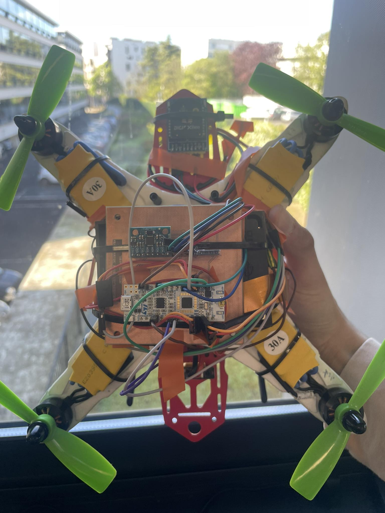

# 🚁 Hybrid AgriUAV (STM32 & Raspberry Pi 5)

Welcome to the Hybrid Agricultural Drone project! 🌾  
Bienvenue sur le projet de Drone Agricole Hybride ! 🌾

  <a href="README_fr.md"><strong>🇫🇷 Lire la documentation technique en Français</strong></a> • 
  <a href="README_en.md"><strong>🇬🇧 Read the full technical documentation in English</strong></a>

---

## 🌎 Project Overview / Présentation Générale

**🇬🇧 English:** This project combines real-time flight controllers (STM32) with high-level intelligence (Raspberry Pi 5) for precision agriculture. The drone stabilizes using computer vision (ArUco) and collects data from ground beacons.

**🇫🇷 Français :** Ce projet combine la fiabilité des contrôleurs de vol temps réel (STM32) avec l'intelligence des micro-ordinateurs (Raspberry Pi 5) pour l'agriculture de précision. Le drone se stabilise par vision (ArUco) et récolte les données de balises au sol.

  

### ✨ Key Features / Points Forts

* 🧠 **Dual-brain architecture / Architecture à double cerveau :** STM32 + Raspberry Pi 5.
* 👁️ **Visual Positioning / Positionnement Visuel :** ArUco marker tracking / *Suivi de marqueurs ArUco.*
* 📡 **Wireless Telemetry / Télémétrie sans fil :** Zigbee & Web GCS.

---

### 👨‍💻 Author / Auteur
**Najd BEN SAAD**

🔗 [LinkedIn](https://www.linkedin.com/in/najd-bensaad/) • 📧 [najd.bensaad@outlook.com](mailto:najd.bensaad@outlook.com)
